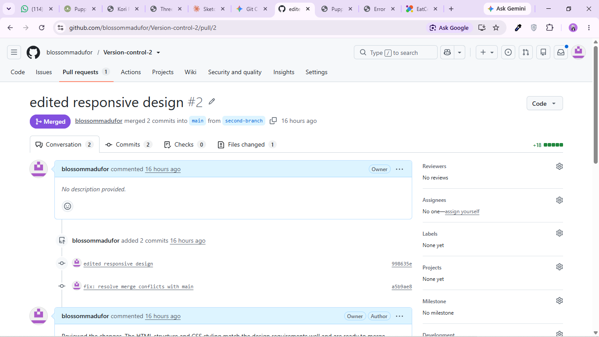
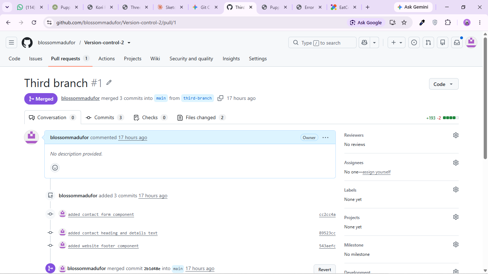
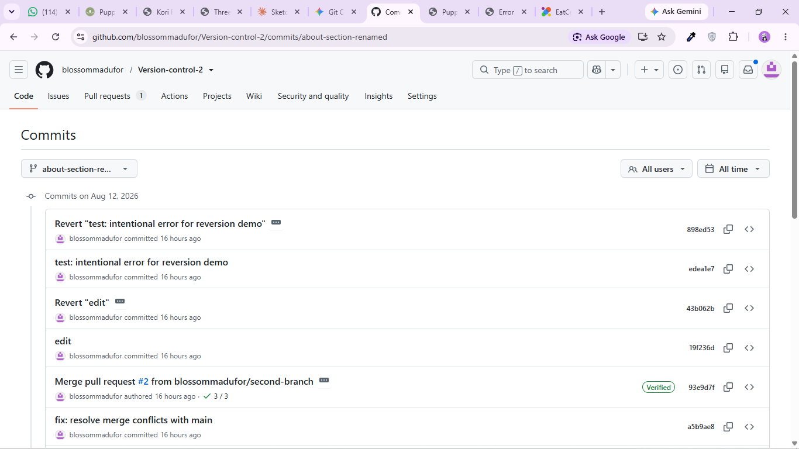
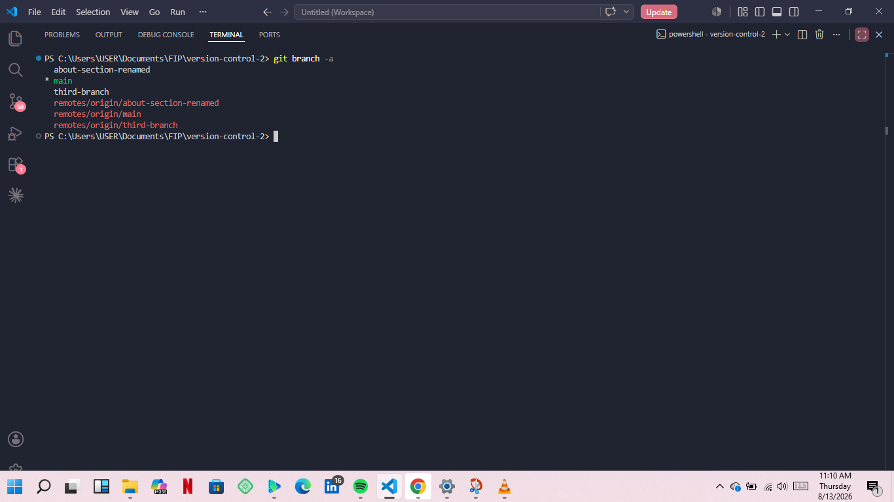

# Puppy Yoga Studio Website

A single-page marketing website built with HTML and CSS using Git multi-branch workflows.

## Features
- **Hero Section:** Intro banner with clear call-to-action button
- **About Section:** Information on puppy yoga sessions and shelter partnerships
- **Contact Section:** Contact form and studio location details
- **Footer Section:** Quick links and copyright notice

## Branch History & Workflow
- `main` – Initial repository setup, base HTML structure, and Hero section
- `second-branch` (renamed to `about-section-renamed`) – About section components and responsive styling
- `third-branch` – Contact section forms, footer, and final layout adjustments

## Reversion & Cleanup Demonstration
- Demonstrated commit reversion using `git revert` to undo experimental styling changes safely.
- Renamed feature branches locally and synchronized remote tracking branches using `git fetch --all --prune`.

## SCREENSHOTS

